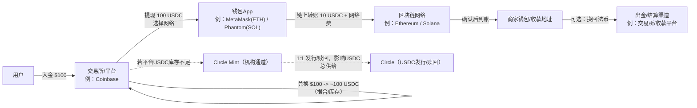
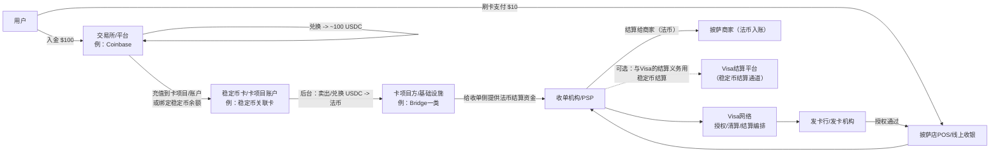
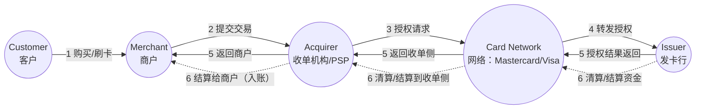
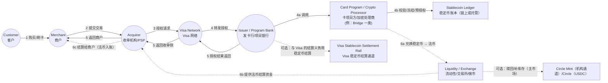
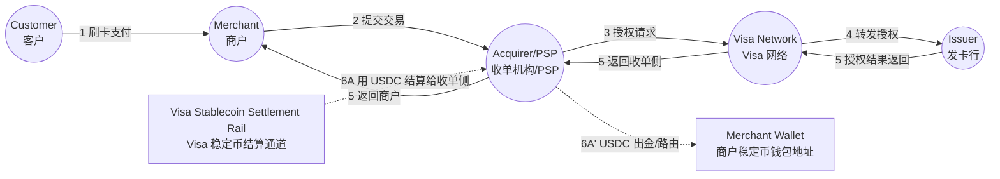
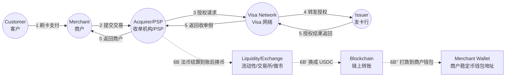
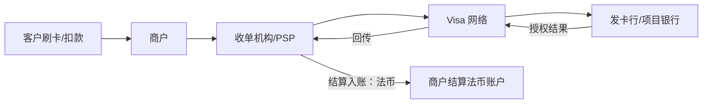
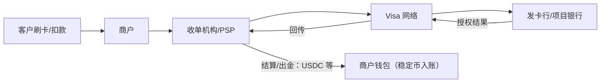

---
diagram:
  engine:
    mermaid:
      mime-type: image/png
      execpath: ["mmdc","-w","2400","-H","1600","-s","4"]
---
# 稳定币价值链与支付落地

**作者：大愚基金 刘成岗**


*目的：用买方视角把“稳定币从发行到支付落地”的关键参与者、分工、资金与信息流讲清，并为跟踪 Visa / Circle / PayPal / Coinbase 等生态公司提供框架。*

*资料口径：文末“参考来源（可核查）”为主要依据；最后核对时间见文末。*

*风险提示：本文由 ChatGPT 辅助生成，不代表作者观点，可能因信息时效、口径差异等导致偏差；仅供研究讨论参考，不构成投资建议、法律意见或任何形式的要约/承诺，请读者自行核查并独立判断。*

## 1. 执行摘要

- **Circle（以 USDC 为例）**：负责稳定币的发行与赎回（mint/burn）体系，以及与储备/兑付相关的制度与运营；主市场多通过机构通道完成。
- **Coinbase（以及其他交易所/钱包/经纪平台）**：更接近“分发入口与流动性中心”——为用户提供买卖、托管、出入金与链上提现等能力；同时在库存不足时可能通过主市场补库存。
- **Visa**：更接近“支付网络与结算编排者”——前台提供刷卡受理与四方模型规则体系；后台可把稳定币接入其结算与出金（Visa Direct）能力，但通常不做稳定币发行与赎回。

> 关键区分：**主市场（mint/burn）** 决定稳定币总供给变化；**二级市场（交易所买卖）** 多数只改变持有人与价格，不一定改变总供给。

---

## 2. 稳定币是什么、为什么需要、合规使用场景

### 2.1 稳定币是什么

- **定义（研究口径）**：稳定币通常指一种加密资产，旨在把价格稳定在某个参考资产（通常是美元等法币）附近。
- **本笔记关注的主流形态**：以**储备支持型（reserve-backed）法币稳定币**为主（如 USDC、USDT、PYUSD、USDG）：发行方通常承诺按 1:1 赎回，并以现金、短久期国债/回购/货币市场工具等高流动性资产做储备支持。
- **直觉对照**：稳定币更像“**在区块链上流通的、可按规则 1:1 兑回的私人负债凭证**”；其可用性与风险边界取决于：发行/赎回机制、储备资产与托管安排、合规与披露要求，以及服务商（交易所/托管/PSP/收单/出金平台）如何把它产品化。

### 2.2 为什么需要稳定币

- **7×24 可交付的结算资产**：可减少跨境结算对工作日/批处理窗口/代理行链条的依赖。
- **更强的可编程性（API/工作流）**：把支付、对账、分账、条件付款等做成可集成能力，适合平台型业务。
- **跨平台互操作**：在不同机构、不同钱包、不同系统之间，以同一种“链上美元”做价值交付。
- **跨境资金调度效率**：对企业财资而言，稳定币可作为资金轨道，在部分场景降低预注资/在途资金占用（是否更省取决于费率与合规成本）。

> 研究提示：对大多数合规落地项目，“稳定币”更多解决**支付后台（结算/出金/资金调度）**痛点，而非让消费者日常“直接用稳定币买咖啡”。

### 2.3 合规使用场景（机构更容易规模化落地）
> 研究提示：对大多数合规落地项目，“稳定币”更多解决**支付后台（结算/出金/资金调度）**痛点，而非让消费者日常“直接用稳定币买咖啡”。

#### 2.3.1 跨境出金与企业付款（payouts / remittances）

- **是什么**：平台/企业把资金“交付给收款人”的链路（工资、创作者分成、供应商款、退款/理赔等）。稳定币被用作**资金交付轨道**或**交付形态**（收款人可收币，或经合规 off-ramp 收法币）。
- **解决的痛点**：
  - 7×24 资金可用性（绕开部分银行工作日/批处理窗口）。
  - 跨境链路更短（减少中间行/代理行层级带来的时间与失败率）。
  - 平台财资：降低多地预注资/在途资金占用（是否更省取决于定价与合规成本）。
- **典型参与者**：资金方（平台/企业/雇主）→ 出金平台（Visa Direct/PSP）→ 稳定币体系（发行方/主市场通道）→ off-ramp（交易所/合规经纪/本地支付机构/银行）→ 收款人（托管账户或自托管钱包）。
- **KPI**：出金金额/笔数、平均到账时间、失败率/退款率；收款人“收币 vs 收法币”占比；单笔全成本（费率+固定费+FX 点差+失败/退款成本）；KYC 覆盖率、可疑交易率、制裁命中处理时效。
- **推荐分母**：
  - 跨境个人汇款（Remittances）年度金额。
  - 平台化出金（Payouts）年度金额（marketplace/工资/分成/理赔等；通常需披露拼接）。
- **可得数据源**：世界银行/迁移数据口径的 remittances；Visa Direct 稳定币试点披露；发行方透明度页（如 Circle）。
- **渗透率公式（可落地）**：
  - `渗透率 = 稳定币用于跨境出金/汇款的年度金额 ÷ 全球（或LMIC）年度 remittances 金额`
  - `渗透率 =（Visa Direct/PSP 通过稳定币轨道完成的年度 payout 金额）÷（该平台/行业年度 payout 总额）`
- **已实施的案例（如有）**：Visa 披露 Visa Direct 的稳定币预注资与“出金到稳定币钱包”试点（见文末参考来源）。

#### 2.3.2 交易与资本市场的“交割腿”（settlement leg）：保证金/交割/做市资金调拨

- **是什么**：把交易/资本市场里的“资金交割腿（cash leg）”用稳定币承载（保证金/交割资金/经纪资金调拨），提升 7×24 交割与资金周转效率。
- **解决的痛点**：减少对银行工作日/批处理窗口依赖；缩短在途时间；跨市场资金调拨更高效；更容易做“条件付款/自动补保证金”（但对合规、托管、风控要求更高）。
- **典型参与者**：做市商/经纪商/OTC 对手方/交易所或清算成员 → 托管机构/结算代理 → 稳定币发行方与主市场通道 → 链与合规模块（制裁筛查/旅行规则等，视地区而定）。
- **KPI**：T+0/T+1 分布（含周末/假日可用性）、失败交割率；保证金占用与回笼速度；资金成本（机会成本）；合规/托管/审计成本。
- **推荐分母**：
  - FX 现货/掉期等市场日均成交额（外汇相关交割/保证金上限）。
  - 证券后交易处理规模（证券交割/结算上限）。
- **可得数据源**：BIS Triennial Survey（FX turnover）；DTCC 年度处理规模披露；发行方透明度披露（供给/链上分布）。
- **渗透率公式（可落地）**：
  - `渗透率 = 稳定币用于FX相关保证金/交割/资金调拨的日均（或年化）金额 ÷ BIS 公布的FX日均成交额（同口径）`
  - `渗透率 = 稳定币用于证券交割/保证金/后交易资金处理的年度金额 ÷ DTCC 等披露的年度处理规模（同口径）`
- **已实施的案例（如有）**：更常见落地在“做市/经纪资金调拨、保证金与 OTC 交割资金”；以项目公告/监管口径为准。

#### 2.3.3 银行与金融机构的“代币化现金/代币化存款”试点（tokenized deposits / tokenized cash）

- **是什么**：银行在许可框架内把存款/现金管理做成链上形态，用于同业清算、企业现金管理、链上抵押品/保证金管理等。
- **解决的痛点**：在银行体系内逼近 7×24 的“可交付现金形态”；把账户体系与链上资产/工作流打通。
- **典型参与者**：银行（发行/管理）→ 企业财资/机构客户（使用）→ 同业清算/托管/审计与风控体系 → 技术平台（如 Visa 披露的 VTAP）。
- **KPI**：覆盖产品线/客户数；链上转移金额/笔数；到账时间/失败率；审计可核查性、系统可用性。
- **推荐分母**：
  - 银行交易性存款/企业现金余额（存量）。
  - 同业清算/大额支付系统处理金额（流量）。
- **可得数据源**：央行/监管统计（存款与支付系统）；银行/平台试点公告；Visa VTAP 披露。
- **渗透率公式（可落地）**：
  - `渗透率 = 代币化存款/代币化现金在外余额 ÷（银行交易性存款余额 或 企业现金余额）`
  - `渗透率 = 代币化存款用于同业/企业转移的年度金额 ÷（同业清算/大额支付系统年度处理金额）`
- **已实施的案例（如有）**：Visa 披露 VTAP 与 BBVA 沙盒测试（见文末参考来源）。

#### 2.3.4 合规的“链上收单/商户收款”（merchant acquiring on-chain）

- **是什么**：商户通过合规 PSP/收款平台“收稳定币”，并获得收款页/二维码、对账报表、风控、税务报表、（可选）自动换回法币与结算入账。
- **解决的痛点**：把链上转账变成“可运营的收款产品”（对账/退款/客服/风控/税务）；跨境线上商户可减少收款摩擦（前提接受不可逆特性）。
- **典型参与者**：商户 → PSP/收款平台（收款/风控/对账）→ 稳定币与链（USDC/USDT/PYUSD/USDG + ETH/Solana 等）→ 出金/换回法币（交易所/经纪/本地支付机构）。
- **KPI**：商户 GMV、成功率、退款/争议率；商户留存与净费率（take rate）；收币后换回法币比例与时点；到账时间。
- **推荐分母**：
  - 目标行业/地区线上收款 GMV（推荐）。
  - 卡/电子支付总额（宏观对照）。
- **可得数据源**：Coinbase Commerce/BitPay 等公开费率与产品说明；美联储 Payments Study 等支付统计；发行方透明度与链上数据。
- **渗透率公式（可落地）**：
  - `渗透率 = 合规链上收单（稳定币收款）年度 GMV ÷（目标行业/目标地区线上收款年度 GMV）`
  - `渗透率 = 稳定币用于商户收款的年度金额 ÷（同口径的卡/电子支付年度总额）`
- **已实施的案例（如有）**：Coinbase Commerce、BitPay 的商户收款产品与公开费率（见文末参考来源）。

#### 2.3.5 支付网络/收单侧的清算结算资产升级（card settlement rail upgrade）

- **是什么**：前台仍是四方模型授权/清算；差异在后台：网络与银行/收单伙伴之间，结算资产从“仅法币”扩展为“法币 + 稳定币”。
- **解决的痛点**：提升结算可用性（含周末/假日）与跨境资金调度效率；为“商户稳定币入账（路径C）”提供底层轨道可能性。
- **典型参与者**：Visa（网络）→ 发卡行/项目银行、收单行/结算银行 → 收单/PSP（如 Worldpay、Nuvei）→ 稳定币发行方与主市场通道（Circle、Paxos 等）。
- **KPI**：上线伙伴数、覆盖地区、支持的稳定币/链；稳定币结算金额/笔数、失败率、到账时间；预注资/在途资金占用是否下降（需财资数据验证）。
- **推荐分母**：
  - 相关地区的网络/收单结算交易额或清算义务规模（按可得披露近似）。
  - 网络/收单相关跨境结算金额（按走廊拆分）。
- **可得数据源**：Visa IR 新闻稿（支持币种/链、试点伙伴、银行参与者）；收单/银行伙伴公告。
- **渗透率公式（可落地）**：
  - `渗透率 = Visa（或收单伙伴）通过稳定币完成的结算金额 ÷（同口径的卡网络结算交易额/清算义务规模）`
- **已实施的案例（如有）**：Visa 披露扩展到收单侧（Worldpay、Nuvei）及美国 USDC 结算与首批银行伙伴（见文末参考来源）。

#### 2.3.6 出金与资金调度（Visa Direct / PSP treasury routing）

- **是什么**：把稳定币用于预注资（prefunding）与资金调度（treasury routing）：用稳定币为出金资金池备付，或把款直接打到稳定币钱包，核心是“跨走廊周转效率”。
- **解决的痛点**：降低多币种、多地资金池备付压力；提升资金周转；提高周末/假日可用性与到账确定性（取决于下游 off-ramp 能力）。
- **典型参与者**：出金平台（Visa Direct/PSP）→ 流动性与换汇（做市/交易所/银行）→ 合规与账户（持牌机构 + KYC/AML/制裁合规）→ 收款端（钱包/托管账户/本地入账账户）。
- **KPI**：预注资平均/峰值余额、周转天数与占用成本；出金金额/笔数、到账时间、失败率；单笔全成本（含 FX 点差、链上费、下游入账成本）。
- **推荐分母**：
  - 平台/走廊年度 payout 金额（流量口径）。
  - 为 payout 持有的备付金/预注资余额（存量口径；多需披露/调研）。
- **可得数据源**：Visa Direct 预注资与钱包直达出金试点披露；平台/PSP 财报与运营指标披露。
- **渗透率公式（可落地）**：
  - `渗透率 = 通过稳定币轨道完成的年度 payout 金额 ÷（该平台/走廊年度 payout 总额）`
  - `渗透率 = 稳定币预注资平均余额 ÷（该平台为 payout 持有的备付金/预注资总余额）`
- **已实施的案例（如有）**：Visa 披露 Visa Direct 的稳定币预注资与“出金到稳定币钱包”试点（见文末参考来源）。

---

## 3. 价值链参与者清单

### 3.1 监管与合规框架（Regulators）
- **详细说明**：决定谁能发行/赎回、资金与制裁合规要求、信息披露/审计要求，以及支付/托管/收单/出金等环节的牌照边界。
- **一句话**：监管定义“能做什么、必须怎么做”。
- **主要参与者**：各司法辖区金融监管机构（央行/金监部门）、支付监管机构、反洗钱与制裁合规相关机构；欧盟侧的 MiCA/MiCAR 框架相关机构（如 EBA 等）。

### 3.2 发行方 / 赎回方（Issuer / Redeemer）
- **详细说明**：负责稳定币的 mint/burn、储备与赎回机制；普通用户多数通过二级市场或平台入口间接使用，并不直接触达主市场。
- **一句话**：决定稳定币“发行/销毁（供给变化）”的总开关。
- **主要参与者**：Circle（USDC/EURC 体系）、Tether（USDT 体系）、Paxos（PYUSD、USDG 相关）。

### 3.3 主市场机构通道（Mint/Redeem Channel）
- **详细说明**：面向合格机构（交易所、做市商、部分金融机构等）的发行/赎回 API/账户体系，把“法币 ↔ 稳定币（链上）”做成可规模化的批发通道。
- **一句话**：主市场通道把稳定币的“批发进出”标准化。
- **主要参与者**：Circle Mint；Tether 官方赎回/发行流程入口；Paxos（PYUSD/USDG）相关的 mint/redeem 文档与通道。

### 3.4 储备资产管理人 / 托管人 / 现金存放银行（Reserve & Custody）
- **详细说明**：稳定币信用的底座是储备资产与托管安排（现金、短久期国债、回购/货币市场工具等）以及赎回流动性管理；这决定了压力情景下能否稳定兑回。
- **一句话**：储备与托管决定“能不能安全、稳定地 1:1 兑回”。
- **主要参与者**：托管银行/现金存放银行、国债/回购/货币市场工具的资产管理与托管体系、发行方的储备管理与风控团队。

### 3.5 审计 / 鉴证与披露（Audit / Attestation / Reporting）
- **详细说明**：通过独立审计/鉴证与定期披露降低信息不对称，增强市场信任；披露频率与口径差异会直接影响机构可用性与风险定价。
- **一句话**：把“信任”变成可核查的报告。
- **主要参与者**：第三方审计/鉴证机构；发行方透明度披露页面与报告体系（如 Circle 透明度披露、Paxos 透明度披露、Tether 储备报告披露）。

### 3.6 二级市场：交易所、经纪与做市商（Exchanges / Brokers / Market Makers）
- **详细说明**：多数用户换到稳定币发生在二级市场（撮合交易、库存/做市提供流动性）；二级市场交易通常不直接改变稳定币总供给，但会改变持有人与短期价格偏离。
- **一句话**：二级市场负责“随时可买卖 + 价格紧贴锚定”。
- **主要参与者**：交易所/经纪平台（如 Coinbase 等）、做市商/流动性提供者。

### 3.7 钱包与托管（Wallets / Custodians）
- **详细说明**：
  - **自托管钱包**：用户自己持有私钥（典型：MetaMask、Phantom 等）。
  - **平台托管**：交易所/钱包 App 帮你保管私钥或做账本余额。
- **一句话**：把链上资产变成用户可用的“账户体验”（自托管或平台托管）。
- **主要参与者**：自托管钱包（MetaMask、Phantom 等）、平台托管方（交易所/钱包 App 的托管与账户体系）。

### 3.8 区块链网络与基础设施（L1/L2, Nodes, RPC）
- **详细说明**：稳定币最终跑在链上；链决定费用、确认速度、最终性与可组合性；节点、RPC 与基础设施决定可用性与接入体验。
- **一句话**：区块链是“资金轨道”。
- **主要参与者**：公链与其基础设施（Ethereum、Solana 等；以及 Visa 披露支持/扩展的 Stellar、Avalanche 等）、节点/RPC/基础设施服务商。

### 3.9 支付受理与清算结算网络（Acquirers / PSPs / Networks）
- **详细说明**：商户受理侧（收单行/PSP/POS）与网络（如 Visa）负责授权、清算、结算编排；稳定币可在后台用于结算或出金，但商户端常常仍收法币（或由 PSP 提供稳定币入账产品）。
- **一句话**：把“链上资金形态”接入“现实商户的收款与对账”。
- **主要参与者**：卡网络（Visa；四方模型对照可类比 Mastercard）、收单机构/PSP（如 Worldpay、Nuvei；以及典型 PSP/收单方案如 Square、Stripe Terminal）、商户侧受理与对账系统。

### 3.10 出金与平台资金方（Payout Platforms / Employers / Marketplaces）
- **详细说明**：出金平台把“资金交付”做成能力（薪资、创作者分成、跨境收款等）；稳定币可用于预注资或直接打到稳定币钱包，提高 24x7 可用性与跨境效率。
- **一句话**：决定“稳定币用在哪些真实业务流里”。
- **主要参与者**：Visa Direct 这类出金平台；企业/雇主；平台型企业（marketplaces/内容平台等）；收款人侧钱包/托管账户。

### 3.11 多稳定币发行体系/发行基础设施商
- **详细说明**：不同稳定币发行体系（USDC、PYUSD、USDG 等）可能通过特定发行基础设施与合规体系进入同一支付/结算网络；这类“基础设施层”通常提供 API、合规集成、清结算/兑换对接等能力。
- **一句话**：让网络支持“多币种、多发行体系”的互操作。
- **主要参与者**：Paxos（PYUSD、USDG 相关体系）；加密支付处理商/基础设施（如 Bridge 一类）；以及面向银行/机构的代币化平台能力（如 Visa 披露的 VTAP）。

### 3.12 稳定币体系对照：USDC / USDT / PYUSD / USDG / USDH / USDe

#### USDC
- **发行主体**：Circle
- **合规情况**：合规/机构导向较强；以储备透明度与第三方鉴证作为信任基础
- **披露频率**：周度披露 + 月度第三方鉴证
- **生态入口**：交易所/机构通道与结算场景较常见
- **赎回入口**：机构通常走 Circle Mint；零售多走二级市场
- **Visa 结算支持**：Visa 已公开披露支持
- **商户接入示例**：Coinbase Commerce（可自动转换为 USDC 等）

#### USDT
- **发行主体**：Tether
- **合规情况**：全球流通广，但在不同地区/机构的合规可接受度差异更大
- **披露频率**：储备报告披露（常见为季度口径）
- **生态入口**：交易所与跨境转账/新兴市场使用惯性强
- **赎回入口**：官方赎回流程（准入/流程以官网为准）
- **Visa 结算支持**：Visa 结算平台公告中未被点名
- **商户接入示例**：BitPay（支持 USDT 收款）

#### PYUSD
- **发行主体**：Paxos Trust Company（PayPal 入口）
- **合规情况**：PayPal 品牌 + Paxos 受监管信托框架
- **披露频率**：月度储备报告/第三方鉴证
- **生态入口**：PayPal 钱包/商户网络分发 + 交易所合作分发
- **赎回入口**：PayPal 端 1:1 赎回；并有透明度与机制披露入口
- **Visa 结算支持**：Visa 已公开披露支持
- **商户接入示例**：BitPay（支持 PYUSD 收款）


#### USDG
- **发行主体**：Paxos Digital Singapore
- **合规情况**：更偏“面向机构/合规标准更高”的定位（具体监管口径以白皮书/官方披露为准）
- **披露频率**：月度透明度/储备报告
- **生态入口**：机构结算/收单/银行集成是关键（生态取决于伙伴落地）
- **赎回入口**：白皮书/开发文档披露 1:1 赎回与 mint/redeem 机制
- **Visa 结算支持**：Visa 已公开披露支持
- **商户接入示例**：以公开披露为准；Visa 结算平台已点名支持


#### USDH
- **发行主体**：Native Markets（面向 Hyperliquid 生态的稳定币发行合作方；以公开披露为准）
- **合规情况**：公开信息显示将由发行方及其法币通道合作伙伴承担 KYC/AML 等合规；具体牌照覆盖与适用地区需以 USDH 官方披露为准
- **披露频率**：未见统一的公开透明度披露节奏（以官方披露为准）
- **生态入口**：以 Hyperliquid 生态内的交易/结算与资金周转为主（例如作为报价/结算资产被集成到生态产品中）
- **赎回入口**：计划通过发行合作方提供 1:1 铸造/赎回与法币出入金能力（具体流程以官方文档为准）
- **Visa 结算支持**：Visa 公开公告中未见点名支持
- **商户接入示例**：公开披露中未见主流收单/PSP 将其作为商户结算资产的示例；更偏生态内使用

#### USDe
- **发行主体**：Ethena（USDe）
- **合规情况**：更偏“合成美元（synthetic dollar）”设计（以抵押品 + 对冲头寸维持锚定），与储备支持型稳定币不同；合规可用性与使用边界需以 Ethena 官方披露与适用地区监管口径为准
- **披露频率**：以链上可验证数据与官方透明度披露为主（披露节奏以官方为准）
- **生态入口**：DeFi 场景与交易平台分发（以支持清单/上币与集成公告为准）
- **赎回入口**：通过 Ethena 的铸造/赎回流程（通常面向合格参与者/白名单机制；以官方文档为准）
- **Visa 结算支持**：Visa 公开公告中未见点名支持
- **商户接入示例**：公开披露中未见 Visa/主流收单将其作为结算资产的示例；更多用于加密金融场景

### 3.13 术语速查（读图与表格的常用缩写）

- **PSP（Payment Service Provider）**：支付服务商，向商户提供收款、风控、对账等一揽子能力。
- **收单（Acquirer）**：商户侧的收单机构/收单行，负责把商户交易接入卡网络并完成结算入账。
- **发卡（Issuer）**：持卡人侧的发卡行/发卡机构，负责授权与卡账户资金/信用管理。
- **项目银行（Program Bank）**：卡项目背后的持牌银行（常见于联名卡/加密卡项目），提供发卡与合规“牌照外壳”。
- **主市场（Mint/Burn）**：发行/赎回导致稳定币总供给变化的渠道（例如 Circle Mint）。
- **二级市场**：交易所/经纪撮合交易，通常只改变持有人，不一定改变稳定币总供给。
- **On-ramp / Off-ramp**：法币进出加密体系的入口/出口（入金、出金、换回法币）。

---

## 4. 用户视角：100 美元换稳定币 + 10 美元披萨（两条最常见路径）

> 设定：以 **USDC** 为例。

### 4.1 第一步：把 100 美元换成 ~100 USDC（入口阶段）

- 你在交易所/平台（例：Coinbase）入金 100 美元。
- 你用 100 美元换到 USDC：界面上通常接近 1:1，但可能存在**手续费/点差**；平台交付的 USDC 往往来自平台库存，或由平台通过机构通道批量申购后再补库存。
- **单笔交易不一定能判断是否触发 Circle 新增发行（mint）**：平台可能先用自有 USDC 库存满足用户需求，再在日终/批量通过主市场通道（如 Circle Mint）补库存；只有当平台在主市场净申购时，才会体现在 USDC 总供给的增加。

### 4.2 第二步：你把 USDC 放在哪里（交易所账本 vs 链上钱包）

- **留在平台**：是平台账本里的 USDC 余额（方便交易/支付，但不是自持私钥）。
- **提到链上钱包**：选择链（Ethereum / Solana 等），把 USDC 提现到你控制的地址（自托管钱包如 MetaMask/Phantom）。


### 4.3 第三步：用 USDC 买 10 美元披萨

- **路径 A：链上直付**（商家直接收稳定币）
  - 商家通常通过收款平台（例：Coinbase Commerce / BitPay / Solana Pay 等）生成地址/二维码。
  - 你用钱包在链上转出 10 USDC（外加网络费）给商家。
  - 商家可选择继续持有 USDC 或换回法币。

- **路径 B：稳定币关联卡刷卡**（你用稳定币余额，但商家收法币）
  - 你用“稳定币关联的卡项目”在商户刷卡。
  - 后台由卡项目/基础设施将你的 USDC 兑换成商户要收的本地法币。
  - Visa 负责授权/清算/结算的网络编排；部分机构层结算可能引入稳定币，但对你刷卡体验通常无感。

---

## 5. 流程图

> 说明：以下流程图为“理解用示意图”，用于对照参与方与资金/信息流；具体落地会因地区、牌照、收单/PSP 产品设计而不同。

### 图 1：链上直付（商家直接收 USDC）



### 图 2：稳定币卡刷卡（稳定币在后台兑换，商家收法币）



### 图 3：四方模型（基线）（Mastercard 官网示意，重绘）
> 说明：下图为 Mastercard 官网 “Payment process” 页面中的经典四方模型流程图重绘（Customer → Merchant → Acquirer → Network → Issuer），便于与稳定币卡流程对照。


### 图 4：商家收法币（稳定币只在后台作为资金来源/兑换）
> 直观理解：前台仍是四方模型；不同点在于“发卡侧/卡项目方”在后台把用户稳定币余额（链上或平台托管账本）转换为商户所需法币，并完成清算/结算资金交付。


### 图 5A：商家收稳定币，通过 Visa 稳定币结算通道

> 直观理解：前台仍是 Visa 四方模型（授权/清算/结算编排）；差异在于**结算资产**——Visa 通过稳定币结算通道把 **USDC** 结算给收单机构/PSP，收单侧再把 USDC 出金/路由到商户的钱包地址。



### 图 5B：商家收稳定币，法币结算后由收单侧换币再出金

> 直观理解：前台仍是 Visa 四方模型；差异在于**入账前换币**——Visa/收单侧先按常规以法币结算，收单机构/PSP 再通过流动性渠道把法币换成 **USDC**，并链上转账到商户的钱包地址。



---

## 6. 路径对比：链上稳定币直付 vs. Visa 网络（商户结算法币 / 商户结算稳定币）

> 目的：把三条路径放到同一张框架里比较：**链上直付**、**刷卡但商户收法币**、**刷卡但商户收稳定币入账**。费用、体验与风控责任的差异，是判断“链上直付能否替代卡网络”的核心。

### 6.1 三种路径总览（同一笔 10 美元披萨）







### 6.2 关键差异对比

- **商户受理改造**
  - 路径A：需要：钱包/收款码/链选择/对账流程
  - 路径B：低：沿用既有 POS/网关/PSP
  - 路径C：中：前台仍沿用卡受理，但收单/PSP 需提供稳定币入账产品

- **用户覆盖/支付习惯**
  - 路径A：取决于用户是否有钱包与稳定币
  - 路径B：高：刷卡习惯成熟、覆盖广
  - 路径C：高（前台同刷卡），对用户几乎无感

- **成本结构（直观）**
  - 路径A：主要是链上手续费 + 出金/换汇成本（若需要法币）
  - 路径B：主要是卡费率/服务费（随地区/行业/卡种变化）
  - 路径C：介于两者：前台仍有卡网络成本，但商户可选择稳定币入账以优化跨境/资金周转（取决于产品定价）

- **交易费（每笔显性手续费）**
  - 路径A：商户收款服务费（示例：Coinbase Commerce 1%；BitPay 1–2% + $0.25）+ 链上网络费（gas/手续费，随链与拥堵波动）+（若要换回法币）出金/换汇点差或费用
  - 路径B：商户通常看到的是收单/PSP 的“综合费率/全包价”（包含：发卡行 interchange + 网络费 + PSP 服务费与风控成本），并非 Visa 单独收费。示例：Square 线下 2.6% + $0.15；Stripe Terminal 2.7% + $0.05
  - 路径C：前台同路径B（仍有综合卡费率）；若商户选择“稳定币入账”，收单/PSP 往往还会叠加：换币点差/处理费（产品定价）+ 链上出金网络费（随链与拥堵波动）

- **示例：$10 显性手续费（按上行示例口径）**
  - 路径A：Coinbase Commerce（1%）→ $0.10 + 链上网络费（变量）；BitPay（按 2% + $0.25）→ $0.45 + 链上网络费（变量）
  - 路径B：Stripe Terminal≈$0.32/笔（2.7% + $0.05）；Square≈$0.41/笔（2.6% + $0.15）
  - 路径C：前台同路径B（$0.32/笔 或 $0.41/笔）+ 商户稳定币入账阶段：链上出金网络费（变量）+ 可能的换币/出金服务费（由收单/PSP 定价，通常不公开统一价）

- **示例：$100 显性手续费（按上行示例口径）**
  - 路径A：Coinbase Commerce（1%）→ $1.00 + 链上网络费（变量）；BitPay（按 2% + $0.25）→ $2.25 + 链上网络费（变量）
  - 路径B：Stripe Terminal≈$2.75/笔（2.7% + $0.05）；Square≈$2.75/笔（2.6% + $0.15）
  - 路径C：前台同路径B（≈$2.75/笔）+ 商户稳定币入账阶段：链上出金网络费（变量）+ 可能的换币/出金服务费（由收单/PSP 定价，通常不公开统一价）

- **示例：$500 显性手续费（按上行示例口径）**
  - 路径A：Coinbase Commerce（1%）→ $5.00 + 链上网络费（变量）；BitPay（按 2% + $0.25）→ $10.25 + 链上网络费（变量）
  - 路径B：Stripe Terminal≈$13.55/笔（2.7% + $0.05）；Square≈$13.15/笔（2.6% + $0.15）
  - 路径C：前台同路径B（Stripe≈$13.55/笔 或 Square≈$13.15/笔）+ 商户稳定币入账阶段：链上出金网络费（变量）+ 可能的换币/出金服务费（由收单/PSP 定价，通常不公开统一价）

- **到账与最终性**
  - 路径A：链上确认后一般不可逆；最终性取决于链
  - 路径B：规则体系内可退款/拒付；结算有批处理窗口
  - 路径C：同路径B（授权规则不变）；但入账形态变为稳定币

- **争议处理/消费者保护**
  - 路径A：通常弱（更多靠商家客服与平台规则）
  - 路径B：强（网络规则、拒付/争议机制）
  - 路径C：强（前台仍是卡网络规则）

- **欺诈/盗刷责任分配**
  - 路径A：更接近“私钥/地址自负”与平台风控
  - 路径B：成熟：网络规则 + 收单/发卡/商户分担
  - 路径C：同路径B（前台规则一致）

- **会计/对账与税务**
  - 路径A：商户需建立链上对账与核算流程
  - 路径B：标准化：对账/结算报表成熟
  - 路径C：需额外处理：稳定币入账的核算/估值/出金（但可由 PSP 产品化）

- **适用场景（倾向）**
  - 路径A：加密原生、跨境小额、线上数字服务、愿意“即付即结”
  - 路径B：大众零售、线下、需要退款/拒付/分期等体验
  - 路径C：跨境收款/资金周转、平台型商户、希望“前台刷卡覆盖 + 后台稳定币入账”

> 读者提示：上表的“显性手续费”只覆盖合同里最常见、最容易看见的那部分。真实的“商户全成本”还会受到：汇率/换币点差、拒付与欺诈损失、对账与客服成本、以及资金占用（D+N 结算）等影响。

> 注：在 `$100` 的示例里，Square（2.6% + $0.15）与 Stripe Terminal（2.7% + $0.05）两者计算结果**恰好都≈$2.75/笔**，这是由“百分比 + 固定费”的组合导致的数值巧合，并不代表两家定价结构或实际合同费率一致；换成其他金额会出现差异。


### 6.2.1 不同稳定币对三条路径的影响

> 这部分只回答一个问题：当你把“USDC”替换成“USDT / PYUSD / USDG”时，三条路径里哪些环节会变、哪些不会。

- **路径A（链上直付）会变的点**：
  - 你能否把该稳定币提到链上、以及**能提到哪条链**（直接决定链上手续费与到账速度）。例如 PayPal 披露 PYUSD 可在 Ethereum/Solana 间选择转出。
  - 商户使用的收款 PSP 是否支持该币种与对应链（示例：BitPay 支持 USDT 与 PYUSD 用于发票收款）。
- **路径B（Visa：商户结算法币）通常不变的点**：
  - 前台仍是四方模型与卡规则；用户资金来源（你持有什么稳定币）更多影响的是**卡项目方/处理商**的换币与风控能力，而不是商户受理流程。
- **路径C（Visa：商户结算稳定币）会变的点**：
  - 关键在于 Visa 结算平台公开支持哪些稳定币作为结算资产：Visa 已披露支持 USDC，并新增支持 PYUSD、USDG；USDT 在 Visa 结算平台公告中未被点名。


> 注：路径C属于“卡网络前台 + 稳定币入账后台”的组合；它成立的基础是 Visa 已披露其稳定币结算能力，并在收单侧（例如 Worldpay、Nuvei）推进相关能力，且在部分场景披露了与银行伙伴的 USDC 结算。

### 6.3 什么时候“没必要走 Visa 网络”？什么时候仍然值得？

- **更可能不走 Visa（偏向路径A）**：
  - 商户愿意直接收币（有钱包、能对账、能处理链上收款客服）；
  - 交易以“不可逆、即时到账”为可接受前提；
  - 用户侧已经普遍持有稳定币/钱包，且场景对“刷卡覆盖/拒付机制/分期”依赖不强。

- **仍然值得走 Visa（偏向路径B）**：
  - 你要的是“最大化支付转化率与覆盖”（用户随手刷卡）；
  - 需要网络规则体系（争议/拒付/风控责任分配）；
  - 商户希望继续以本币法币入账，降低财务与运营复杂度。

- **两者兼得（偏向路径C）**：
  - 前台仍希望用刷卡覆盖用户；
  - 后台希望以稳定币入账以优化跨境/资金周转/24x7 结算可用性（具体能力落地依赖收单/PSP 产品设计与定价）。

---

## 7. 市场现状与增长驱动

### 7.1 市场规模与结构（以公开口径为准）

- **稳定币整体规模**：IMF（2025-10）指出稳定币总市值持续增长并 **突破 3,000 亿美元**。CoinDesk Data（2025-09）口径下，稳定币总市值约 **2,930 亿美元**。
- **头部集中度**：CoinDesk Data（2025-09）口径下，USDT 规模约 **1,720 亿美元**、市场份额 **58.8%**。
- **利率敏感性（决定发行方“储备收益”价值池）**：CoinDesk Data 给出示例口径：一次 **25bp 降息**可能使“前五大稳定币”合计年化收入减少约 **5 亿美元**（USDT 约 **3.25 亿美元**，USDC 约 **1.60 亿美元**）。

> 买方提示：当你把稳定币放进模型时，真正能驱动利润与估值重估的，往往是 **储备收益（利率）** 与 **分发/通道份额变化**，而不只是“市值”。

### 7.2 主要增长驱动

- **监管清晰度提升 → 机构采用增加**：IMF（2025-10）指出，美国的 GENIUS Act 通过与欧洲 MiCA 的应用，为机构采用提供了更清晰的路径。
- **结算与出金（payout）场景更先落地**：Visa 的公开披露显示，其稳定币布局更偏向 **结算可用性/资金调度效率** 与 **出金场景**，而非让零售消费者“直接用稳定币支付”。
- **商户侧“全成本”与可运营性是分水岭**：是否能做到低摩擦对账、风控、退款与税务处理，决定“链上直付”能否在商户侧规模化替代卡网络（与第 6 章呼应）。

---

## 8. 价值池与商业模式（谁赚什么钱）

> 把“谁赚什么钱”拆成 5 件事：**客户是谁**、**谁付钱**、**怎么计费**、**主要成本项**、**稳定币带来什么变化**。

### 8.1 一张表看清：主要参与者的收费对象与计费方式

- **发行方（Circle/USDC、Tether/USDT、Paxos/PYUSD、Paxos/USDG 等）**
  - **客户是谁**：机构主市场客户、生态合作伙伴
  - **谁付钱（最终成本归属）**：主要来自储备收益；部分来自机构服务/合作分成（以披露为准）
  - **怎么计费（常见形态）**：储备收益（利率敏感）+（可选）机构服务费/合作分成
  - **主要成本项**：托管/合规/运营、赎回流动性管理、渠道分成（尤其：USDC 与 Coinbase 的分润/分发成本）
  - **稳定币带来的变化（买方要点）**：**最清晰的价值池：储备收益**；份额与合规可用性决定“默认结算资产”地位

- **交易所/经纪/托管入口（以 Coinbase 为例）**
  - **客户是谁**：零售与机构用户、商户
  - **谁付钱（最终成本归属）**：用户/商户付费（交易、托管、出入金、商户产品）+ **Circle 分润（USDC 储备收益分成；以披露为准）**
  - **怎么计费（常见形态）**：交易费/价差、托管/账户服务费、出入金/提现费、商户收款服务费（产品化定价）+ **stablecoin revenue（来自与 Circle 的 USDC 储备收益分成安排）**
  - **主要成本项**：合规与风控、流动性/做市、基础设施与客服
  - **稳定币带来的变化（买方要点）**：稳定币越主流，越提升“入口活跃度”与商户收款需求；并可能通过与发行方的分润安排分享部分 USDC 储备收益（口径以披露为准）

- **收单/PSP（Square/Stripe/Worldpay/Nuvei 等）**
  - **客户是谁**：商户
  - **谁付钱（最终成本归属）**：商户付费（通常“一口价/全包价”）
  - **怎么计费（常见形态）**：按金额百分比 + 每笔固定费；或更复杂的分层定价
  - **主要成本项**：需要向发卡行支付 interchange、向网络支付 network fees；还要承担风控/拒付/运营成本
  - **稳定币带来的变化（买方要点）**：“商户收稳定币入账”会新增：换币点差/处理费 + 链上出金费 + 钱包/对账服务费（取决于产品设计）

- **卡网络（Visa）**
  - **客户是谁**：发卡行/收单机构/PSP（B2B 客户）
  - **谁付钱（最终成本归属）**：由收单/发卡侧支付（最终通常体现在商户成本中）
  - **怎么计费（常见形态）**：网络处理/评估/服务费；增值服务（风控、token、数据产品）；出金平台（Visa Direct）服务费
  - **主要成本项**：网络与风控基础设施成本；合规成本
  - **稳定币带来的变化（买方要点）**：稳定币更多是**结算资产与资金轨道扩展**：提升 24x7/跨境结算与出金能力，并增强客户粘性

- **发卡行/项目银行（Issuer/Program Bank）**
  - **客户是谁**：持卡人（零售）与商户侧（间接）
  - **谁付钱（最终成本归属）**：interchange 主要由商户侧成本承担；也可能向持卡人收年费等
  - **怎么计费（常见形态）**：interchange（按交易额/品类/卡种而变）+（可选）年费/利息/分期等
  - **主要成本项**：信用损失/欺诈损失、资金成本、运营与合规
  - **稳定币带来的变化（买方要点）**：稳定币卡项目的关键是：资金来源与换币/风控如何做；但发卡侧价值池仍主要由卡业务决定

- **加密支付处理商/基础设施（如 Bridge 一类）**
  - **客户是谁**：卡项目方、平台、PSP
  - **谁付钱（最终成本归属）**：B2B 客户付费（项目方/平台/PSP）
  - **怎么计费（常见形态）**：API/处理费、换币服务费、账户/合规服务费（以披露为准）
  - **主要成本项**：合规、清结算对接、流动性与风控
  - **稳定币带来的变化（买方要点）**：在“稳定币关联卡/商户稳定币入账”路径中承担关键的兑换/路由/合规集成

> 重要澄清：商户看到的费率（例如 Square/Stripe）通常是 **收单/PSP 的“全包报价”**，并不等同于“Visa 单独收费”。全包报价里会包含：**发卡行的 interchange + 网络费 + PSP 自己的服务费与风控成本**。

### 8.2 三条路径各自的“价值池归属”一眼看懂

- **路径 A：链上直付（商户直接收稳定币）**
  - 钱主要流向：链（网络费）+ 收款平台/支付处理商（如 Commerce/BitPay 的商户服务费）+（如需换回法币）交易所/做市/出金点差。
  - 谁“赚得最确定”：收款平台/支付处理商（商户服务费）与链（网络费）。

- **路径 B：刷卡但商户收法币（传统四方模型，稳定币在后台仅作为资金来源/兑换）**
  - 钱主要流向：发卡行/项目银行（interchange）+ Visa（网络费/服务费）+ 收单/PSP（商户服务费）。
  - 稳定币在哪赚钱：多发生在“后台换币/资金调度”环节（由项目方/处理商/流动性渠道获取点差或服务费）。

- **路径 C：刷卡但商户收稳定币入账**
  - 前台仍有：发卡行/项目银行（interchange）+ Visa（网络费/服务费）+ 收单/PSP（商户服务费）。
  - 额外新增：商户“稳定币入账”的换币/出金/对账服务费（由收单/PSP/处理商产品化定价）+ 链上出金费。
  - 买方判断关键：**新增费用能否被“跨境/资金周转/24x7 结算”的价值覆盖**，否则商户没有动力从 B 迁移到 C。

### 8.3 相关公司

#### 8.3.1 Circle（USDC）：最明确的是“储备收益”，其次是“合作伙伴通道与分成”（以披露为准）

- **钱从哪来**：储备收益（利率敏感）是最直观价值池；此外还可能存在与生态伙伴/渠道的合作分成与机构服务收入（需以披露与合同口径为准）。
- **成本与约束**：托管、合规、运营与赎回流动性管理；以及对分发伙伴的收入分成/激励支出（USDC 生态中与 Coinbase 的合作分润是最大单项之一，且随 USDC 规模、利率与 Coinbase 平台持币占比变化）。
- **稳定币竞争的本质**：当 Visa/收单/PSP 把稳定币“产品化”时，USDC 能否成为默认结算资产取决于合规可用性、流动性与伙伴覆盖。

#### 8.3.2 Visa：赚“网络与能力费”，稳定币更像结算轨道升级

- **钱从哪来**：网络处理/服务费 + 增值服务（风控、数据、token 等）+ Visa Direct 出金能力服务费。
- **稳定币怎么影响**：更可能体现为提升客户粘性与扩展可服务场景（结算可用性、跨境资金调度、出金产品）。

#### 8.3.3 Coinbase：赚“入口活跃度”与“产品化服务费”（而非稳定币利息）
- **钱从哪来**：交易、托管、出入金、以及面向商户的收款/对账产品（如 Commerce）。
- **与 Circle 的分润/经济安排（USDC）**：Coinbase 在其披露中提到与 Circle 的合作安排会**分享 USDC 储备产生的日度收益**（stablecoin revenue），其规模与 **USDC 平台余额/USDC 总市值/利率水平**相关；相关协议在 2023-08 更新、并在 2024-11 进一步更新（以披露文本为准）。
- **稳定币怎么影响**：稳定币越普及，越能提升平台内“现金等价物”的留存与周转，从而带动交易/出入金/商户收款等收入池；同时也会放大上述分润项对利润波动的影响（利率与 USDC 需求）。

#### 8.3.4 PayPal（PYUSD）：更像“提升网络闭环与交易量”的产品，而不是单独的利息生意

- **钱从哪来**：PayPal 的核心仍是支付网络的交易与服务费；PYUSD 更像降低摩擦、提升留存与频次的产品形态。PYUSD 的储备收益如何分配需以 PayPal/Paxos 的披露为准。

---

## 9. 合规与落地约束（按地区/角色拆解要点）

> 说明：下列为研究框架，不构成法律意见；不同国家/州/产品结构会显著影响牌照与合规边界。

### 9.1 欧盟：MiCA（MiCAR）对稳定币发行与服务商的约束（高层）

- EBA 指出：在 MiCA 框架下，**ART/EMT 发行方需要获得在欧盟开展相关活动的授权**。
- Central Bank of Ireland 对 MiCAR 的概述可作为欧盟监管框架入口。


### 9.2 美国（高层）：机构采用高度依赖监管清晰度与分工

- IMF（2025-10）将美国监管清晰化作为机构采用的推动因素之一。
- 买方落地视角：发行/赎回（主市场）、托管、支付受理（收单/PSP）、以及“出金/资金交付”往往分属不同合规边界；商业化路径经常取决于合作伙伴如何分工与持牌。


### 9.3 采用阻力/监管摩擦（对零售支付与商户落地）

> 直观结论：**“链上直付（路径A）摩擦最大，刷卡但商户收法币（路径B）摩擦最小，刷卡但商户收稳定币入账（路径C）介于两者之间”。** 稳定币要进入大众零售支付，难点往往不在“能不能转账”，而在“税务/合规/风控/对账能不能规模化”。

**A. 税务与记账负担（美国尤其显著）**
- 在美国联邦税口径下，IRS 将 **digital assets 视为财产（property）而非现金/货币**；稳定币也属于 digital assets 的范畴。用户用 USDC 等稳定币购买商品/服务，本质上是一次“处置资产”，原则上需要用美元口径计算并申报资本利得/损失（金额可能很小，但记账要求仍在）。
- 实务影响：零售小额高频支付会产生大量“成本基础（basis）—公允价值（FMV）”的明细追踪需求，显著抬高用户侧采用门槛（除非由钱包/平台自动化报税与记账）。
- 监管趋势：IRS 已发布与 **Form 1099-DA** 相关的数字资产经纪商交易报告指引（以 IRS 公告为准），数据可得性提升会进一步强化合规/报税要求。

**B. KYC/AML 与制裁合规：谁来做、做到什么程度**
- 稳定币支付链路里，“入金/出金/兑换/托管/支付受理”往往由不同主体承担；监管关注点在于：客户身份识别（KYC）、可疑交易监测（AML）、制裁名单筛查、资金来源与受益所有人等。
- 典型摩擦：路径A 的“自托管钱包 → 商户钱包”在用户体验上最轻，但在合规可控性上最弱；因此更容易依赖收款 PSP/聚合器把合规“外包产品化”。

**C. 消费者保护与争议处理：退款/拒付与责任分配**
- 卡网络（路径B/部分路径C）有成熟的争议/拒付与责任划分机制；链上直付（路径A）通常“转账即最终”，需要商户/平台自建客服、退款与风控规则。
- 实务结果：大众零售场景往往更偏好“可逆/可仲裁”的支付体验，这对路径A 是结构性摩擦。

**D. 商户财务、对账与税务：从“收款”到“可入账”的一整套流程**
- 商户更关心的是：对账报表、入账币种、会计处理、税务口径（收入确认/增值税/销售税/汇兑差额）、以及资金回笼速度（D+N）与现金管理。
- 路径C 的价值在于：前台继续沿用卡受理与对账习惯，后台把“稳定币入账/跨境资金周转”产品化；但如果定价叠加过多（卡费率 + 换币/出金费 + 链上费），商户经济性会成为主要阻力。

**E. 链与运营风险：费用波动、拥堵、地址误转与私钥管理**
- 网络费（gas）波动与链拥堵会造成成本与到账时间不确定；地址误转与私钥丢失通常不可逆，要求更强的操作与风控体系。

> 参考：以上税务与报告义务相关结论，可核查 IRS 官方页面（见文末新增参考来源：IRS Digital assets；IRS Digital asset transactions FAQ；IRS 1099-DA 报告指引）。

---

## 10. 竞争格局与对生态公司的影响（USDC vs USDT vs PYUSD vs USDG）

### 10.1 竞争主战场

- **交易所与跨境转账**：USDT 仍保持显著规模与份额领先。
- **合规可用的机构结算与支付网络合作**：USDC/PYUSD/USDG 更容易在“传统支付网络与金融机构点名支持”的叙事中获得增量（例如 Visa 公开披露对 USDC/PYUSD/USDG 的结算支持）。
- **分发入口**：PayPal 的优势在于消费级钱包与商户网络；Coinbase 的优势在于交易所分发与商户收款产品。


### 10.2 Visa 的“多币种支持”对 USDC 生态意味着什么？

- Visa 从更偏 USDC 的早期试点，扩展到支持 PYUSD、USDG、EURC，体现了 Visa 更像 **中立的结算轨道**。
- 买方解读：对 USDC 来说，护城河不只是“被支持”，还包括在收单/PSP 产品化时能否成为默认选项（合规可用性、流动性、伙伴覆盖与运营成熟度）。


### 10.3 份额/增速与“单寡头/双寡头终局”讨论（网络效应视角）

**为什么“市值/份额/增速”是关键指标**
- 对稳定币而言，**流通市值（≈流通量）**直接反映“被市场持有的美元代币规模”；而**份额（dominance）**反映“默认结算资产/默认报价资产”的地位。
- 与“谁在用”更贴近的链上指标还包括：活跃地址数、交易笔数、结算金额（volume）。但在买方跟踪中，市值/份额/增速往往是最稳定、最可对齐的底层指标。

**现状：USDT + USDC 已形成显著集中度（但口径会随数据源略有差异）**
- CoinMarketCap 口径下，稳定币板块总市值约 **3,181.76 亿美元**；USDT 市值约 **1,862.50 亿美元**（约 **58.54%**）；USDC 市值约 **781.06 亿美元**（约 **24.55%**）。两者合计约 **83.08%**。（截至 2025-12-17；属页面快照口径，引用前建议刷新复核）

**网络效应确实存在，但未必“赢家通吃”**

- 支持“趋向双寡头/高度集中”的逻辑：
  - **流动性与可得性**：交易所/做市/借贷/衍生品更愿意围绕最深流动性的币种建仓与报价；商户/PSP 也倾向先接入最通用的币种，从而强化头部优势。
  - **合规与信任成本**：储备透明度、鉴证/审计、赎回通道、制裁合规能力等，会抬高后来者追赶门槛。
  - 监管与研究讨论中也常用“USDT/USDC 双寡头”描述当前格局。

- 反对“单/双寡头终局”、认为会出现“多强并存”的逻辑：
  - **链与场景分化**：不同链的费用/速度差异使稳定币呈现“链上分工”。例如 DeFiLlama 的 Solana 口径下，Solana 链上稳定币中 USDC 规模显著高于 USDT，同时 PYUSD、USDG 也已有一定规模；这说明“局部生态”并非只剩一个币种。
  - **监管分割市场**：不同司法辖区对发行人、托管、披露的要求不同，可能天然形成“区域/机构偏好”的多稳定币并存。
  - **产品抽象降低锁定**：钱包/支付路由/聚合器若把用户体验抽象为“美元余额”，底层用哪种稳定币结算可能被弱化，网络效应会被部分稀释。

**买方可操作结论（建议写入跟踪表）**
- 用一组“硬指标”跟踪是否真的向寡头终局收敛：
  1) USDC/USDT 市值与份额（dominance）
  2) 各自主力链上的供给分布变化（尤其：USDT 在 Tron/ETH；USDC 在 ETH/Solana/L2）
  3) 活跃地址与交易笔数（按链拆分）
  4) 主市场（mint/burn）净增与二级市场深度（流动性、价差）
- 若未来 12–24 个月头部份额持续上升且“新币种只能在补贴/收益驱动下维持”，则更接近“寡头收敛”；反之若份额继续被新币种稳定侵蚀且多链/多场景形成稳定分工，则更接近“多强并存”。

---

## 11. 关键 KPI 与催化剂（建议建立跟踪表）

### 11.1 核心 KPI（按公司/生态）

- **Visa**：参与稳定币结算的伙伴名单与覆盖区域、结算平台支持的稳定币与链扩展节奏、Visa Direct 稳定币出金试点扩张。
- **Circle（USDC）**：USDC 市值（流通量/Market Cap）、在稳定币总市值中的份额（Dominance）、供给净增与增速（按 7d/30d/YoY 跟踪）、透明度披露节奏、主市场通道合作伙伴与可用性。（示例：CoinMarketCap 显示 USDC 市值约 781.06 亿美元、稳定币总市值约 3,181.76 亿美元，对应份额约 24.55%，截至 2025-12-17；属页面快照口径，引用前建议刷新复核）
- **PayPal（PYUSD）**：月度透明度报告/鉴证持续性、链与生态集成节奏。
- **Coinbase**：Commerce 等商户产品的功能迭代与费率策略。

### 11.2 催化剂

- 监管落地或范围扩大（机构可用性显著提升）。
- 头部收单/PSP 大规模上线“商户稳定币入账”（改变第 6 章路径C的可得性）。
- 商户侧“全成本”出现确定性下降（尤其在跨境与出金场景）。

---

## 12. 风险清单

- **利率下行风险（发行方价值池）**：储备收益受利率影响；CoinDesk Data 给出降息对行业收入的示例敏感性。
- **监管与执法不确定性**：监管口径变化会直接影响发行/赎回、托管、收单/PSP 与跨境出金的可得性。
- **储备与兑付风险**：储备结构、托管安排与赎回流动性管理决定挤兑压力下的兑付质量；相关研究与监管讨论可作为核查入口。
- **链上与运营风险**：链拥堵、地址误转、私钥丢失、合约漏洞等会影响“直付/稳定币入账”路径的体验与可运营性（与第 6 章一致）。

---

## 13. 尽调问题清单（按 Visa / Circle / Coinbase / PayPal）

> 目的：把本笔记的“框架”落到可问、可核查、可跟踪的尽调问题上。以下问题可用于：管理层沟通、渠道/伙伴访谈、或对公开披露做核对。

### 13.1 Visa（结算轨道 + 出金平台 + 网络规则）

**A. 产品边界与商业化**
- Visa 在稳定币相关业务里，哪些是“网络费/处理费/增值服务费”的延伸，哪些是新增收费产品（例如结算通道、Visa Direct 稳定币出金）？
- 稳定币结算与 Visa Direct 的收费口径是什么：按笔、按金额、还是按服务包？费用由谁支付（收单/发卡/企业客户），最终谁承担？
- 商户“稳定币入账”（路径C）目前是 Visa 主推方向，还是更多由收单/PSP 自行产品化？Visa 在其中承担哪一段（结算资产、路由、合规、对账标准）？

**B. 伙伴结构与覆盖**
- 现阶段稳定币结算/出金的核心伙伴是谁（银行、收单/PSP、基础设施商），各自承担什么（持牌、资金、清结算、链上操作、商户产品）？
- 哪些地区/走廊优先推进（跨境收款、平台出金、商户稳定币入账），选择依据是什么（监管、需求、成本、伙伴成熟度）？

**C. 风控、争议与合规**
- 交易前台仍是卡规则：对于“后台稳定币结算/出金”，Visa 在欺诈、制裁、可追踪性与合规审计上提供哪些标准或工具？
- 若商户以稳定币入账，退款/拒付如何处理（用法币还是稳定币回退），谁承担汇率/价格波动与运营复杂度？

**D. 跟踪指标（问清楚口径）**
- 可公开或可披露的 KPI：已上线伙伴数量、覆盖地区、支持的稳定币与链、稳定币结算/出金交易量（如有）、平均到账时间、失败率与风控指标。

---

### 13.2 Circle（USDC：发行/赎回 + 储备与透明度 + 通道合作）

**A. 供给与通道（主市场）**
- USDC 的主市场客户结构：交易所/做市商/机构客户分别占比与集中度如何？
- Circle Mint 的准入标准、额度管理与风控流程是什么？在压力情景下（挤兑/链拥堵）赎回 SLA 如何定义？
- 与关键分发渠道（例如交易所/托管/支付处理商）的经济分配：是否存在分成或激励安排？（若未披露，至少确认“有/无”与原则）

**B. 储备、收益与成本（价值池核心）**
- 储备资产构成与久期管理原则；现金与国债/回购/货币市场工具的比例与变动边界。
- 储备收益在财务报表中的确认口径；与渠道/伙伴分成、托管与合规成本的拆分口径。
- 利率下行时，Circle 如何对冲或调整商业策略（例如通道扩张、费率/分成结构调整）？

**C. 合规与可用性**
- 在关键地区（美国/欧盟/新兴市场等）USDC 的合规定位与可用性边界：哪些场景能做主市场赎回、哪些只能二级流通？
- 机构采用的障碍主要是什么（牌照、审计、链选择、制裁合规），Circle 当前的解决路径是什么？

### 13.3 Coinbase（分发入口 + 交易/托管 + 商户收款产品）

**A. “入口优势”是否可持续**
- Coinbase 在稳定币（尤其 USDC）上的核心优势来自哪里：交易分发、托管账户、出入金通道、还是商户产品？哪些最难被复制？
- 用户将稳定币留在平台 vs 提到链上的比例/趋势如何（这决定了托管黏性与链上生态外溢）？

**B. 商户收款（Commerce）与 B2B 收费**
- Commerce 的定价、费率豁免条件（如有）、以及商户的“净留存率/续费率/复购率”口径。
- 商户侧最常见的需求是：直接收稳定币、自动换回法币、还是多链多币种收款？Coinbase 在这些需求上的产品路线图？

**C. 与 Circle/USDC 的关系（经济与风险）**
- Coinbase 与 Circle 在 USDC 生态中的分工与经济关系：哪些收益来自 USDC（例如生态激励/分成/利息相关安排），哪些只是交易与产品服务费？（以披露为准）
- 若 Visa/PayPal/其他渠道推多币种结算，Coinbase 对 USDC 的“默认偏好”是否会变化？变化条件是什么？

### 13.4 PayPal（PYUSD：钱包分发 + 商户网络 + 合规框架）

**A. 分发与场景落地**
- PYUSD 的核心使用场景：PayPal 内部转账/支付、对外链上转出、商户收款、还是跨境出金？当前“主场”是什么？
- PayPal 如何推动商户侧采用：折扣/补贴、结算激励、还是产品功能（更快到账/更低跨境成本）？

**B. 经济模型与成本**
- PYUSD 的储备收益如何在 PayPal 与发行/托管方之间分配（若未披露，至少确认原则与会计处理口径）？
- PayPal 在 PYUSD 相关业务上的目标：更偏交易量/留存（网络效应）还是直接的利息/手续费收入？

**C. 合规与风险控制**
- 在不同地区，PYUSD 的可用性边界（购买/持有/转出/商户收款）有什么差异？
- 对用户保护、退款/争议、制裁合规与风控策略是否与传统 PayPal 余额体系一致，还是引入了新流程？

---

# 附一：Visa 正在开展的稳定币业务（截至 2025-12-16）

> 说明：本附录为“业务线梳理 + 关键合作方 + 进展时间点”的学习总结。日期与表述以 Visa 及相关合作方公开新闻稿/官网披露为准；后续可能随监管与产品进展更新。
> 
> 读者提示：附录按 Visa 公告口径整理，优先回答“Visa 做什么、不做什么；支持哪些稳定币/链；合作伙伴分别承担什么”。

## A. 稳定币结算（Settlement）：把稳定币接入 Visa 的清算/结算体系

### A1）做什么
- 让部分 **发卡行（issuer）** 与 **收单行/收单机构（acquirer/PSP）** 可以用稳定币与 Visa 进行结算（相当于把“结算资产”从纯法币扩展到“法币 + 稳定币”）。
- 目标是提升结算可用性（含周末/假日）与资金调度效率，并在传统支付轨与链上资产之间实现互操作。

### A2）支持哪些稳定币与区块链
- 稳定币：**USDC、EURC**（Circle 体系）；以及通过与 Paxos 合作支持的 **PYUSD、USDG**。
- 区块链网络（已披露支持/扩展支持）：**Ethereum、Solana、Stellar、Avalanche**。

### A3）代表性进展（按时间）
- **2023-09**：扩展到收单侧试点，点名 Worldpay、Nuvei；并披露引入 Solana（同时也提到 Ethereum）。
- **2025-07**：披露其结算平台升级为“多币种 + 多链”，新增 Stellar、Avalanche，并引入 EURC、PYUSD、USDG。
- **2025-12-16**：披露在美国推出 USDC 结算；首批参与银行包括 Cross River Bank、Lead Bank，并在 Solana 上开始以 USDC 与 Visa 结算。

### A4）这一条线里 Visa 的位置（一句话）
- **Visa 是结算编排者与接入方**：把稳定币“接入”自身结算体系，让银行/收单伙伴在与 Visa 结算时可选用稳定币。

## B. Visa Direct：把稳定币用到“跨境出金/发薪/平台打款”链路

### B1）稳定币预注资（Prefunding）试点
- **做什么**：机构/企业可用稳定币给 Visa Direct 资金池预注资（减少跨境业务对多地法币预备金的依赖）。
- **用户/收款人体验**：收款人一般仍可收本地法币（不要求收款人持有稳定币）。
- **披露时间点**：Visa 在 2025-09 的公开信息中披露该类试点，并提到后续扩展规划。

### B2）稳定币钱包直达出金（Payout to stablecoin wallet）试点
- **做什么**：平台/企业可通过 Visa Direct 把款直接发到收款人的稳定币钱包；资金方可仍以法币出资，收款人选择以 USDC 等稳定币收款。
- **披露时间点**：Visa 在 2025-11 的公开信息中披露该类试点，并提到后续推广规划。

### B3）这一条线里 Visa 的位置（一句话）
- **Visa 是“出金平台能力提供方”**：把稳定币作为资金来源或交付形态嵌入 Visa Direct 的出金链路。

## C. VTAP（Visa Tokenized Asset Platform）：面向银行的“法币上链/代币化存款/稳定币”平台

### C1）做什么
- 提供一套面向金融机构的发行、管理与集成能力，覆盖“发行/转移/赎回/生命周期管理”等环节（可用于 tokenized deposits、stablecoins 等）。

### C2）代表性合作方与进展
- Visa 披露 **BBVA** 在 VTAP 沙盒中测试相关能力，并规划后续在公共链（以太坊）上进行试点。

### C3）这一条线里 Visa 的位置（一句话）
- **Visa 是工具/平台提供商**：帮助银行把“法币与存款的链上形态”产品化，而非自己成为发行方。

## D. 稳定币关联卡（消费落地）：稳定币余额在后台换成商户所需法币

### D1）做什么
- 用户持有稳定币余额，但在商户侧（通常）仍以法币结算：刷卡时由卡项目/基础设施在后台完成“稳定币 → 法币”的兑换与结算资金提供。

### D2）代表性披露
- 媒体报道 Visa 与 Bridge 推出“稳定币关联 Visa 卡”，其模式核心就是后台把稳定币余额转换为商户需要的本地货币，从而在 Visa 商户网络内可用。

### D3）这一条线里 Visa 的位置（一句话）
- **Visa 是消费受理网络与结算编排者**：让“稳定币资金来源”以卡支付形态无感进入商户受理体系。

## E. 稳定币咨询与生态（非交易/非发行）

- Visa 也披露推出稳定币相关咨询能力（教育、落地规划、生态对接），用于帮助机构客户理解与部署稳定币在结算、出金与支付中的用例。

## F. 合作伙伴与分工（速查表）

- **Circle**：USDC / EURC 体系（稳定币发行与赎回通道、储备/兑付体系）；也是 Visa USDC 结算能力的重要合作方。
- **Paxos**：Visa 结算平台中对 **PYUSD、USDG** 的支持由其合作引入（发行/合规/基础设施依币种而定）。
- **Worldpay、Nuvei**：收单侧/支付服务商试点伙伴（收单结算链路的一端）。
- **Crypto.com**：早期发行侧试点伙伴之一（与 Visa 结算相关的用例披露）。
- **Cross River Bank、Lead Bank**：Visa 披露的美国 USDC 结算首批银行伙伴。
- **BBVA**：VTAP 试点披露合作银行。
- **Bridge（媒体披露）**：稳定币关联卡的后台基础设施与兑换/结算资金支持。

## G. 一句话总结（把 Visa 放回价值链）

- **Visa 不做稳定币发行/赎回**；它主要做三件事：
  1) 把稳定币接入自己的 **结算层（Settlement）**；
  2) 在 **Visa Direct** 里提供“预注资/钱包直达”的稳定币出金能力；
  3) 通过“稳定币关联卡”等形态，让稳定币资金来源在后台完成兑换后进入商户受理网络。

---

# 附二：Circle 与 Coinbase 的 USDC 合作协议要点（公开披露摘要）

> 说明：本附录仅基于公开披露做“条款结构化摘要”，用于理解 **USDC 的分发成本/利润分配**；不构成法律意见。具体以双方最新披露与协议文本为准。

## 0. 协议期限、续期与“买断”传闻核对（基于公开披露）

### 0.1 协议有效期与续期机制
- **生效日（Effective Date）**：协议约定的生效日为 **2023-08-18**。
- **初始期限（Initial Term）**：自生效日起 **3 年**。
- **续期（Renewal Term）**：
  - 在每个期限结束前，双方会在约定窗口内就是否需要修改条款进行善意讨论；
  - **若在“Determination Date”前未能就续期条款达成一致，但阈值条件（Threshold Criteria）满足**，则协议会就相关稳定币 **自动续期 3 年**。
  - 因此可把它理解为“**三年一期、满足条件则自动续期**”，而不是无条件永久自动续期。
- **自动终止的一种情形**：若不再有任何“Applicable Stablecoins”在流通中，协议会自动终止。

### 0.2 关于“Circle 可一次性买断分润/提前终止”的核对结论
- 在目前可公开核查的 **Collaboration Agreement（SEC Exhibit 10.1）**文本中，我**没有看到**明确写明：Circle 可以通过一次性支付（lump sum / buyout）来“买断”Coinbase 的分润权或将其从协议经济条款中剔除的条款。
- 协议中更常见的“经济调整/退出”机制，来自：**期限到期 + 续期条件**、以及在阈值不达标时对某些经济项的**剔除/暂停**与相关的**终止条款**。
- 你听到的“买断”如果指的是 **2023 年 Circle 收购 Coinbase 在 Centre 的剩余权益并终止 Centre Consortium 的安排**，那属于“已发生的股权/治理结构调整”，与“未来可选的一次性买断分润条款”不是同一件事。

> 备注：如你希望进一步“把条款写到可建模的程度”，建议你把你听到的来源（例如访谈纪要/研报原文/推特线程）贴出来，我可以对照公开协议逐条核对哪些是事实、哪些是推测、以及哪些可能是“未公开但被市场解读”的信息。

## A. 背景：为什么这份协议对“Circle 成本结构”至关重要

- USDC 的商业模式以“储备收益（reserve income）”为主，但为了获得分发与生态增长，Circle 需要向关键分发伙伴支付分润/激励。
- 在 USDC 生态里，Coinbase 既是核心分发入口之一，也是收益分配的重要参与方；因此，从买方建模角度，**把 Coinbase 的分润视作 Circle 的分发成本（distribution costs）**更便于理解利润弹性。

## B. 经济条款（高层框架）：Payment base → Issuer retention → Party product economics → Ecosystem economics

以下为公开披露中的“计算口径结构”（为便于阅读，省略了部分定义细节）：

1) **Payment base（支付基数）**
- 以 USDC 储备产生的“日度收益”为起点，扣除第三方储备管理相关费用（如资产管理费、托管费）及其他约定费用后得到。

2) **Issuer retention（发行方留存）**
- Circle 会先从 payment base 中保留一部分（披露口径：按 USDC 当日流通量对应的年化若干 bp 区间），用于补偿发行与储备管理的间接成本（会计、资金、合规、监管、运营等）。

3) **Party product economics（按平台持币占比分配）**
- 在扣除 issuer retention 后，按“USDC 在 Circle/ Coinbase 各自托管产品或托管钱包服务中的占比”进行分配（披露中描述为：各方按其平台/托管产品所持 USDC 占比获得相应份额）。

4) **Ecosystem economics（生态分配：Coinbase 50%）**
- 在进一步扣除“其他经双方共同批准的生态参与方（approved participants）”应得的激励后，**Coinbase 还会获得剩余 payment base 的 50%**（披露口径）。

> 买方解读：在这一框架下，**Coinbase 平台持有的 USDC 占比越高，Circle 需要向 Coinbase 支付的分发/分润成本越高**；该项对 Circle 的利润率具有一阶影响。

## C. 会计处理与规模：分发成本（distribution costs）

- 披露口径下，Circle 向 Coinbase 支付的上述款项在财务报表中计入 **distribution costs（分发成本）**。
- 公开披露给出了 2022–2024 年 Circle 因与 Coinbase 协议产生的分发成本规模（美元口径，具体以披露为准）。

> 买方解读：当利率上行带来储备收益扩张时，Circle 的“毛收益”会上升，但同时 **分发成本也可能同步上升**；因此需要同时跟踪：利率、USDC 规模、以及 USDC 在 Coinbase 平台的占比。

## D. 2024-11：Stablecoin Ecosystem Agreement（生态参与方补充协议）与 approved participants

- 公开披露显示，双方在 2024-11 对合作协议做了补充安排，引入“approved participants（经双方批准的生态参与方）”框架：
  - 在第三方成为 approved participant 之前，Circle 与 Coinbase 会先约定该第三方可获得的 residual payment base 份额，以及其需要承担的推广/持币等义务。
  - 对 approved participants 的支付，会在 residual payment base 分配给 Circle/Coinbase 之前先行扣除。
- 披露中点名 Binance 作为首个 approved participant，并披露了与 Binance 相关的一次性费用与后续月度激励费安排（具体以披露口径为准）。

## E. 风险与治理条款（只列对投资者最“有影响”的方向）

- 协议包含与产品/转售相关的阈值或条件安排；若相关条件未满足且未能按约定纠正，可能影响 Coinbase 在某些经济分配项下的权利（以披露口径为准）。
- 公开披露还提到在特定法律/监管限制情形下，双方可能触发商标/许可安排的调整机制（披露中称为“flip”机制）；这属于“极端情形下的治理与连续性安排”。

---

# FAQ（持续更新）

## Q1：从“货币创造与销毁”的角度，Circle 像央行、Coinbase 像商业银行吗？

结论：这个类比有启发性，但不能直接等同；更准确的理解是“Circle 控制 USDC 的 mint/burn（供给变化），Coinbase 多数时候提供二级市场分发/交易/托管入口（改变持有人，不一定改变总供给）”。

**相似点**
- USDC 总量的扩张/收缩，确实对应“发行（mint）/赎回销毁（burn）”这一套机制；从宏观视角看有点像“供给开关”。
- Coinbase 等平台面向用户提供“买卖、持有、转账、提现到链上”等入口体验，外观上像“账户入口”。

**关键差异**
- Circle 不是央行：它不发行法币、也不做货币政策；USDC 更像“可按 1:1 兑回的私人负债/凭证”，供给扩张通常需要先进入等额准备金。
- Coinbase 通常不是商业银行：其核心是交易撮合/托管与出入金通道，不等同于“通过放贷创造存款”的信用创造机制。
- 主市场 vs 二级市场不同：Circle mint/burn 属于主市场（影响总供给）；你在 Coinbase 买卖多数是二级市场（主要改变持有人）。
- 风险与保障不同：平台余额/托管资产一般不等同于受存款保险保护的银行存款（是否受保护取决于司法辖区与具体产品结构）。

**更贴近的类比**
  - Circle：更像“100%准备金的稳定币发行人 + 赎回结算代理（把美元代币化）”。
  - Coinbase：更像“交易所/券商 + 托管人 + 零售入口（必要时连接主市场补库存）”。

备注：后续有更多问题可继续追加到本 FAQ。


## Q2：如果商家“收稳定币”，也可以走 Visa 卡四方模型网络吗？

结论：**分两种情况**。

1) **顾客用稳定币在链上直接付款（商家地址收币）**：
- 这通常 **不走 Visa 四方模型**，而是“链上转账/加密支付通道”（可以把 Visa 理解为完全不在这条链路上）。

2) **顾客仍然刷 Visa 卡，但商家希望最终“入账稳定币”（而不是法币）**：
- 这在产品形态上是可以成立的：前台仍是 Visa 四方模型（授权/清算/结算流程不变），但在**结算/出金环节**，由收单机构/PSP 把应收款以 **USDC 等稳定币** 形式打给商户钱包。
- Visa 曾公开披露：Visa 可用 USDC 向 Worldpay、Nuvei 做结算付款，而它们再把 USDC 路由给其“终端商户（end merchants）”。
- 另一个更“上游”的形态是：发卡行/收单行与 Visa 之间的 VisaNet 结算义务本身以 USDC 结算（机构侧的结算资产选择），这也为商户侧“收稳定币”提供了基础设施可能性，但是否落到商户层取决于收单伙伴的产品设计。

对照提醒：你前面提到的“稳定币关联卡”更常见的版本其实是**顾客侧用稳定币余额，商户侧仍收法币**（后台把稳定币换成法币给商户入账）。这与“商户收稳定币”正好相反。

---

# 参考来源（可核查）

> 最后核对时间：2025-12-17（链接与页面结构可能更新，建议你在需要引用时再次打开核对原文）。

**来源 1：Mastercard 四方模型（Payment process）**
```
https://www.mastercard.com.hk/en-hk/business/merchants/start-accepting/payment-process.html
```

**来源 2：Visa 扩展稳定币结算到收单侧（并引入 Solana；点名 Worldpay、Nuvei）— 2023-09-05（Investor Relations）**
```
https://investor.visa.com/news/news-details/2023/Visa-Expands-Stablecoin-Settlement-Capabilities-to-Merchant-Acquirers/default.aspx
```

**来源 3：Visa 扩展稳定币结算支持（新增 EURC、PYUSD、USDG；新增 Stellar、Avalanche）— 2025-07-31（Investor Relations）**
```
https://investor.visa.com/news/news-details/2025/Visa-Expands-Stablecoin-Settlement-Support/default.aspx
```

**来源 4：Visa 在美国推出 USDC 稳定币结算（提及 Cross River Bank、Lead Bank、Solana）— 2025-12-16（Investor Relations）**
```
https://investor.visa.com/news/news-details/2025/Visa-Launches-Stablecoin-Settlement-in-the-United-States-Marking-a-Breakthrough-for-Stablecoin-Integration/default.aspx
```

**来源 5：Visa Direct 稳定币“预注资（prefunding）”试点 — 2025-09-30（Visa Newsroom）**
```
https://usa.visa.com/about-visa/newsroom/press-releases.releaseId.21696.html
```

**来源 6：Visa Direct 稳定币“钱包直达出金（payouts to stablecoin wallets）”试点 — 2025-11-12（Investor Relations）**
```
https://investor.visa.com/news/news-details/2025/Visa-Direct-Stablecoin-Payouts-Pilot-Speeds-Up-Access-to-Funds-for-Creators--Gig-Workers/default.aspx
```

**来源 7：Visa 推出 VTAP（Visa Tokenized Asset Platform），并披露 BBVA 试点 — 2024-10-03（Visa Newsroom）**
```
https://usa.visa.com/about-visa/newsroom/press-releases.releaseId.20881.html
```

**来源 8：Visa 与 Bridge 合作推出稳定币关联 Visa 卡能力 — 2025-04-30（Investor Relations）**
```
https://investor.visa.com/news/news-details/2025/Visa-and-Bridge-Partner-to-Make-Stablecoins-Accessible-for-Everyday-Purchases/default.aspx
```


**来源 9：Circle USDC 透明度页面（周度披露储备 + 月度第三方鉴证）**
```
https://www.circle.com/transparency
```

**来源 10：Circle Mint（机构主市场：USDC/EURC 发行与赎回通道）**
```
https://www.circle.com/circle-mint
```

**来源 11：Tether Transparency（储备报告披露频率：通常按季度发布；并可按链查看流通指标）**
```
https://tether.to/transparency/?tab=reports
```

**来源 12：Tether 赎回到法币（官方指引/流程页面，用于理解主市场赎回路径）**
```
https://tether.to/ru/redeem-tethers-to-fiat-currency/
```

**来源 13：PayPal PYUSD 产品说明（1:1 赎回 + 月度储备报告/鉴证提示）**
```
https://www.paypal.com/us/digital-wallet/manage-money/crypto/pyusd
```

**来源 14：Paxos PYUSD 透明度页面（月度储备报告/鉴证入口）**
```
https://www.paxos.com/pyusd-transparency
```

**来源 15：PayPal Newsroom：PYUSD 上 Solana（并披露可在 Ethereum/Solana 选择转出）— 2024-05-29**
```
https://newsroom.paypal-corp.com/2024-05-29-PayPal-USD-Stablecoin-Now-Available-on-Solana-Blockchain%2C-Providing-Faster%2C-Cheaper-Transactions-for-Consumers
```

**来源 16：Paxos USDG 透明度页面（月度储备报告/鉴证入口）**
```
https://www.paxos.com/usdg-transparency
```

**来源 17：Paxos Newsroom：Paxos Introduces Global Dollar (USDG)（发行主体/储备银行伙伴等披露）— 2024-10-31**
```
https://www.paxos.com/newsroom/paxos-introduces-global-dollar-usdg
```

**来源 18：USDG Whitepaper（PDF：发行主体、监管框架与设计）— 2024-10-25**
```
https://424565.fs1.hubspotusercontent-na1.net/hubfs/424565/USDGWhitePaper.pdf
```

**来源 19：Paxos Developer Docs：USDG Overview（1:1 赎回与 mint/redeem 指引入口）**
```
https://docs.paxos.com/guides/stablecoin/usdg
```

**来源 20：BitPay：支持的加密资产列表（含 USDT、PYUSD 等）— 2025-06-17 更新**
```
https://support.bitpay.com/hc/en-us/articles/37436300598157-List-of-Supported-Cryptocurrencies-and-Associated-White-Papers
```

**来源 21：Coinbase Commerce（商户收款：可自动转换为 USDC 的产品说明）**
```
https://www.coinbase.com/commerce
```

**来源 22：CoinDesk Data — Stablecoins & CBDCs Report（2025-09；含稳定币市值、USDT 份额与利率敏感性示例）**
```
https://data.coindesk.com/reports/stablecoins-cbdcs-report-september-2025
```

**来源 23：IMF — Crypto Assets Monitor（2025-10 PDF；提到稳定币市值突破 3,000 亿美元与监管推动因素）**
```
https://www.imfconnect.org/content/dam/imf/News%20and%20Generic%20Content/GMM/Special%20Features/GMM%20Special%20Feature%20-%20Crypto%20Monitor%20October%202025.pdf
```

**来源 24：S&P Global Ratings — Stablecoins, Financial Stability, And Treasuries（2025-12；关于稳定币与美债/金融稳定的研究入口）**
```
https://www.spglobal.com/ratings/en/regulatory/article/stablecoins-financial-stability-and-treasuries-whats-next-for-money-and-safe-assets-s101659822
```

**来源 25：ECB Financial Stability Review Focus — Stablecoins on the rise（2025-11；讨论稳定币增长与金融稳定关注点）**
```
https://www.ecb.europa.eu/press/financial-stability-publications/fsr/focus/2025/html/ecb.fsrbox202511_05~63636227b4.en.html
```

**来源 26：EBA — Asset-referenced and e-money tokens (MiCA)（欧盟对 ART/EMT 发行方授权要求入口）**
```
https://www.eba.europa.eu/regulation-and-policy/asset-referenced-and-e-money-tokens-mica
```

**来源 27：Central Bank of Ireland — Markets in Crypto-Assets Regulation (MiCAR)（MiCAR 监管框架概述入口）**
```
https://www.centralbank.ie/regulation/markets-in-crypto-assets-regulation
```

**来源 28：Coinbase Commerce 费用说明（商户收款 1% 手续费）**
```
https://help.coinbase.com/en/commerce/getting-started/fees
```

**来源 29：BitPay 商户支付处理费说明（1–2% + $0.25/笔）**
```
https://support.bitpay.com/hc/en-us/articles/203324073-What-fees-will-I-pay-to-use-BitPay-for-payment-processing
```

**来源 30：BitPay Pricing（分层费率页，按月度累计交易额分档）**
```
https://www.bitpay.com/pricing
```

**来源 31：Square 官方费率（线下刷卡 2.6% + 15¢ 等）**
```
https://squareup.com/us/en/payments/our-fees
```

**来源 32：Stripe Terminal 费率口径（2.7% + $0.05/笔，可能随地区/时间调整）**
```
https://stripe.com/en-jp/newsroom/news/stripe-launches-terminal
```

**来源 33：Visa 对 interchange/费用结构的官方说明（用于理解“综合费率”构成）**
```
https://usa.visa.com/support/small-business/regulations-fees.html
```

**来源 34：CoinMarketCap — Top Stablecoin Tokens by Market Capitalization（稳定币板块总市值口径）**
```
https://coinmarketcap.com/view/stablecoin/
```

**来源 35：CoinMarketCap — Tether (USDT)（市值/流通量等）**
```
https://coinmarketcap.com/currencies/tether/
```

**来源 36：CoinMarketCap — USDC（市值/流通量等）**
```
https://coinmarketcap.com/currencies/usd-coin/
```

**来源 37：DeFiLlama — Stablecoins on Solana（按链拆分的稳定币规模示例）**
```
https://defillama.com/stablecoins/solana
```

**来源 38：Systemic Risk Centre — Supervisory Dilemmas in a Dollarised Tokenised World（提及 USDT/USDC 双寡头与网络效应的风险讨论）**
```
https://www.systemicrisk.ac.uk/learning-live-crypto-supervisory-dilemmas-dollarised-tokenised-world
```

**来源 39：IMK Study — Stablecoins and the Future of Money（提及网络效应与“双发行人”格局的研究讨论，PDF）**
```
https://www.boeckler.de/pdf/p_imk_study_100_2025.pdf
```

**来源 40：Coinbase Global, Inc. — Form 10‑K（2024 年度；披露与 Circle 的 USDC 合作安排与 stablecoin revenue 口径）**
```
https://s27.q4cdn.com/397450999/files/doc_financials/2024/q4/Coinbase-Global-Inc-2024-10K-for-IR.pdf
```

**来源 41：Coinbase Blog — Updating the agreements with Circle for USDC（披露与 Circle 更新合作与经济安排，2023-08）**
```
https://www.coinbase.com/blog/updating-the-agreements-with-circle-for-usdc
```

**来源 42：Circle Internet Group, Inc. — S-1 Registration Statement（SEC：披露与 Coinbase 的 Collaboration Agreement 经济结构、distribution costs、2024-11 补充协议与 approved participants 等）**
```
https://www.sec.gov/Archives/edgar/data/1876042/000119312525070481/d737521ds1.htm
```

**来源 43：Circle × Coinbase — Collaboration Agreement（SEC Exhibit 10.1；含协议期限与续期条款）**
```
https://www.sec.gov/Archives/edgar/data/1876042/000119312525070481/d737521dex101.htm
```


**来源 44：Reuters — Coinbase to invest in Circle, shut down jointly managed Centre (2023-08-21；Centre 相关结构调整背景）**
```
https://www.reuters.com/markets/deals/coinbase-invest-circle-shut-down-jointly-managed-centre-2023-08-21/
```

**来源 45：IRS — Digital assets（数字资产税务总入口：明确 digital assets 按 property 处理，并说明处置/计算口径）**
```
https://www.irs.gov/filing/digital-assets
```

**来源 46：IRS — Frequently asked questions on digital asset transactions（数字资产交易 FAQ：用数字资产支付商品/服务会触发处置与资本利得/损失计算）**
```
https://www.irs.gov/individuals/international-taxpayers/frequently-asked-questions-on-digital-asset-transactions
```

**来源 47：IRS Newsroom — Final regulations and related IRS guidance for reporting by brokers on sales and exchanges of digital assets（1099-DA 报告与时间点口径）**
```
https://www.irs.gov/newsroom/final-regulations-and-related-irs-guidance-for-reporting-by-brokers-on-sales-and-exchanges-of-digital-assets
```

**来源 48：FSB — High-level Recommendations for the Regulation, Supervision and Oversight of Crypto-Asset Activities and Markets: Stablecoin recommendations（含 stablecoin/GSC 定义，PDF，2023-07）**
```
https://www.fsb.org/uploads/P170723-3.pdf
```

**来源 49：BIS CPMI — Considerations for the use of stablecoin arrangements in cross-border payments（跨境支付用例与合规考量，PDF，2023-10）**
```
https://www.bis.org/cpmi/publ/d220.pdf
```

**来源 50：IMF — Understanding Stablecoins（用例、风险与监管综述，2025-12）**
```
https://www.imf.org/en/publications/departmental-papers/issues/2025/12/02/understanding-stablecoins-570602
```


**来源 51：ECB Occasional Paper — Toss a stablecoin to your banker（稳定币与 e-money/存款对照，PDF）**
```
https://www.ecb.europa.eu/pub/pdf/scpops/ecb.op353~11120d3428.en.pdf
```

**来源 52：World Bank — Remittances to low- and middle-income countries（用于跨境汇款分母口径入口）**
```
https://blogs.worldbank.org/en/peoplemove/remittances-low-and-middle-income-countries-expected-grow-34-2025
```

**来源 53：Migration Data Portal — Remittances（全球 remittances 规模入口；用于跨境汇款分母口径）**
```
https://www.migrationdataportal.org/themes/remittances
```

**来源 54：BIS — Triennial Central Bank Survey: FX turnover in April 2025（FX 日均成交额分母口径）**
```
https://www.bis.org/press/p250724.htm
```

**来源 55：DTCC — DTCC reports annual processing volumes/value（证券后交易处理规模分母口径入口）**
```
https://www.dtcc.com/news/2025/january/30/dtcc-reports-annual-processing-volumes-value
```


**来源 56：Federal Reserve — The Federal Reserve Payments Study（卡/ACH/支票等支付总量口径入口）**
```
https://www.federalreserve.gov/paymentsystems/fr-payments-study.htm
```

**来源 57：Ethena Docs — USDe（合成美元）概览与术语（发行与机制口径入口）**
```
https://docs.ethena.fi/
```

**来源 58：Ethena Docs — Minting & Redeeming USDe（铸造/赎回流程与准入口径）**
```
https://docs.ethena.fi/usde/usde-minting-and-redeeming
```

**来源 59：Ethena Governance — USDe Proof of Reserves（透明度/可核查机制入口）**
```
https://governance.ethena.fi/t/usde-proof-of-reserves/155
```

**来源 60：Cointelegraph — Native Markets officially claims Hyperliquid’s USDH stablecoin ticker（USDH 归属与背景事件，2025-09-14）**
```
https://cointelegraph.com/news/native-markets-officially-claims-hyperliquids-usdh-stablecoin-ticker
```

---

*免责声明：本文仅供研究讨论与学习交流之用，内容基于公开信息与作者（含 AI 辅助）整理，可能因信息时效、口径差异或理解偏差而存在疏漏与不准确之处；我们不就其准确性、完整性或适用性作任何明示或暗示的保证。*
*本文所载资料、观点与推测不构成任何投资建议、交易依据、法律或税务意见，亦不构成任何形式的要约、要约邀请或承诺。读者应自行核查原始资料并独立判断；因使用本文内容所产生的任何直接或间接损失，作者不承担责任。未经书面许可，任何机构或个人不得以任何形式转载、复制、发表或引用；如经许可引用，应注明出处且不得歪曲、删节或修改原意。*